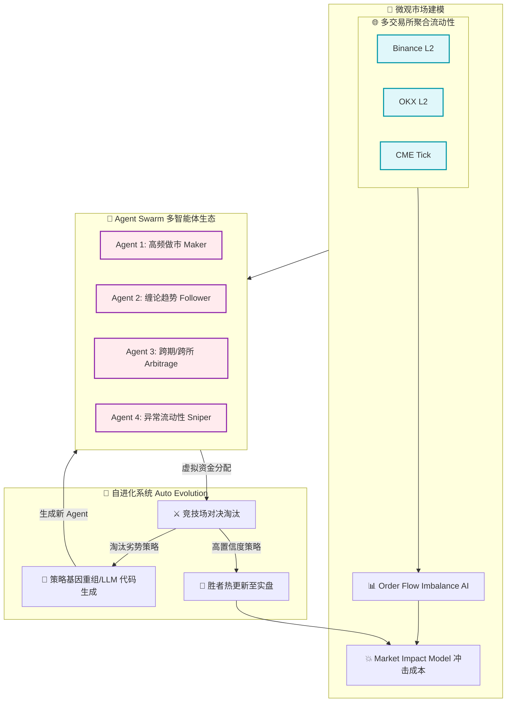

# ⚡ Trading OS：高级交易系统架构说明书

## 🧭 系统总览
该系统是一个融合了以下特性的全栈交易仿真与决策系统：
* 📡 **微观市场数据**（Order Book / Tick / Trade）
* ⏱ **utick级回放与延迟仿真**
* 🏦 **交易所级撮合引擎**（Matching Engine）
* 🧠 **AI策略层**（LLM + 强化学习）
* 📊 **传统量化策略层**（缠论 / ABM）

系统核心定位为：**“一个面向可训练市场（Market-as-RL-Environment）的数字市场仿真操作系统（Trading OS），支持交易所级撮合仿真与多智能体交易生态，并融合LLM与强化学习驱动的智能决策框架。”**

---

## 🧱 一、系统分层架构

```text
┌──────────────────────────────────────────────┐
│                🧠 AI 决策层                  │
│   LLM市场理解 + RL策略决策 + 策略选择器      │
└──────────────────────────────────────────────┘
┌──────────────────────────────────────────────┐
│            📊 量化策略层（ABM/缠论）         │
│   结构识别 + 信号生成 + 多策略融合           │
└──────────────────────────────────────────────┘
┌──────────────────────────────────────────────┐
│        🏦 撮合引擎（Matching Engine）        │
│   订单簿 + 撮合算法 + 成交回报 + 队列模拟    │
└──────────────────────────────────────────────┘
┌──────────────────────────────────────────────┐
│   ⏱ utick回放 + 延迟仿真 + 滑点模型层        │
│   Event Sourcing + Latency + Fill Probability│
└──────────────────────────────────────────────┘
┌──────────────────────────────────────────────┐
│        📡 微观市场数据层（真实市场输入）     │
│   L2/L3 OrderBook + Tick + Trade Prints      │
└──────────────────────────────────────────────┘
```

---

## 🔗 二、全局系统融合闭环图（Trading OS Core）

展示了从微观数据到 AI 决策，再到撮合反馈的完整闭环。

```mermaid
flowchart TD
    classDef data fill:#e3f2fd,stroke:#0288d1,stroke-width:2px;
    classDef engine fill:#fff3e0,stroke:#f57c00,stroke-width:2px;
    classDef strat fill:#e8f5e9,stroke:#388e3c,stroke-width:2px;
    classDef ai fill:#f3e5f5,stroke:#7b1fa2,stroke-width:2px;

    subgraph ENV [🌍 市场仿真环境 (Market Environment)]
        MD[📡 微观市场数据 L2/L3 Tick]:::data --> REPLAY
        REPLAY[⏱ utick 回放与延迟注入]:::engine --> MATCH
        MATCH[🏦 交易所级撮合引擎]:::engine -->|Fill / OrderBook State| STATE
    end

    subgraph OBS [👁️ 状态观测与特征工程]
        STATE[📊 当前市场与账户状态] --> QUANT
        QUANT[📐 传统量化层: 缠论/ABM/指标]:::strat --> FEATURE
        STATE --> FEATURE[🧩 融合特征向量 State Representation]
    end

    subgraph BRAIN [🧠 AI 决策中心 (AI Brain)]
        FEATURE --> LLM[🤖 LLM 市场语义理解]:::ai
        FEATURE --> RL[🧠 RL 强化学习 Agent]:::ai
        LLM -.->|语义先验/环境上下文| RL
        RL -->|Policy| ACTION[⚡ 交易动作 Action]
    end

    subgraph EXEC [⚙️ 交易执行与进化]
        ACTION --> ROUTER[📝 订单路由与执行]
        ROUTER -->|Order 注入| MATCH
        MATCH -->|PnL/滑点/延迟| REWARD[🏆 奖励函数 Reward]
        REWARD -.->|Policy Update| RL
    end

    %% 核心闭环驱动
    ACTION -.->|改变环境状态| ENV
```

---

## 📡 三、核心层级设计规范

### 1. 微观市场数据层（Market Microstructure）
* **输入数据**：L2 / L3 Order Book、Tick Data Stream、Trade Prints（逐笔成交）
* **核心作用**：提供真实市场微观结构，支撑高频级别仿真，作为所有策略与撮合的“真实世界输入”。

### 2. utick回放与延迟仿真层
* **Event Sourcing**：所有市场行为记录为事件流。
* **utick级回放**：精确到“单事件级别”重放市场。
* **延迟建模**：网络延迟（Network Latency）、撮合延迟（Matching Delay）、排队延迟（Queue Position）。
* **滑点与成交概率**：Slippage Model、Fill Probability Engine。

### 3. 交易所级撮合引擎（Matching Engine）
* **订单簿结构**：Bid/Ask Heap，Price-Time Priority Queue。
* **撮合规则**：Price Priority（价格优先）、Time Priority（时间优先）。
* **队列模拟**：Queue Position Tracking、Partial Fill Simulation。

### 4. AI策略层（LLM + RL）
* **LLM市场理解层**：识别市场结构（趋势/震荡/异常流动性），解释盘口行为，输出“市场语义层”。
* **强化学习层（RL Agent）**：
  * *状态 (State)*：Order Book、账户状态、波动结构。
  * *动作 (Action)*：开、平、加仓、观望。
  * *奖励 (Reward)*：PnL、回撤、成交质量、滑点成本。

---

## 🔥 四、Level 2：多智能体与自进化架构（Agent Swarm & Auto-Evolution）

引入多交易所、冲击成本和 Agent Swarm 机制，打造终极交易形态。


