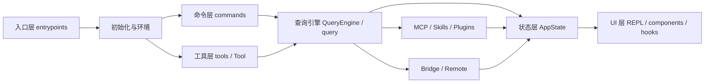

# 主系统架构

## 1. 架构概览

主 TypeScript 系统可抽象为 8 个层次：

1. 入口层
2. 初始化与环境层
3. 命令层
4. 工具层
5. 查询引擎层
6. 状态与 UI 层
7. 扩展层
8. 远程与桥接层

它们之间的关系如下：

## 2. 入口层

### 2.1 `entrypoints/cli.tsx`

这是最前面的 bootstrap 入口，职责不是“真正执行业务”，而是先快速识别特殊路径并尽量减少模块加载。

它处理的典型 fast-path 包括：

- `--version`
- `--dump-system-prompt`
- `--claude-in-chrome-mcp`
- `--chrome-native-host`
- `--computer-use-mcp`
- `--daemon-worker`
- `remote-control | rc | remote | sync | bridge`
- `daemon`
- `ps | logs | attach | kill`

只有在这些特殊路径都不命中时，才会进入完整 CLI 主程序。

### 2.2 `main.tsx`

`main.tsx` 是真正的主运行入口。它完成：

- 早期环境变量与安全保护设置
- 交互 / 非交互模式识别
- client type 决定
- settings 预加载
- `run()` 调用

其中 `run()` 会继续完成 commander 初始化、`init()`、命令装配、工具装配、REPL 或 headless 路径分发。

## 3. 初始化与环境层

### 3.1 初始化职责

初始化工作主要分散在：

- `entrypoints/init.ts`
- `main.tsx` 中的 `run()`
- 多个 `utils/*` 模块

职责包括：

- 配置启用
- keychain / settings 预热
- 日志 sink 初始化
- client type 与 session source 标识
- terminal title 等运行时行为设置

### 3.2 上下文构建

`context.ts` 提供两个重要函数：

- `getSystemContext()`
- `getUserContext()`

它们分别负责：

- 系统上下文：git 状态快照、调试用 cache breaker
- 用户上下文：`CLAUDE.md` / memory 文件与当前日期

这些上下文不会直接执行查询，而是作为系统提示词拼装的原料。

## 4. 命令层

### 4.1 命令注册中心

`commands.ts` 是命令系统的中枢。它不是某一个命令的实现，而是“命令聚合器”。

它汇总：

- 内建命令
- feature flag 控制的延迟命令
- bundled skills
- 插件提供的命令
- workflow commands
- MCP 相关命令

### 4.2 命令系统的定位

命令层解决的是“用户能触发什么行为”。它偏控制面，而不是执行面。

典型命令包括：

- `review`
- `config`
- `doctor`
- `init`
- `skills`
- `tasks`
- `plugin`
- `version`

## 5. 工具层

### 5.1 工具协议

`Tool.ts` 定义整个工具系统的统一协议和上下文，最重要的是：

- `ToolUseContext`
- 工具权限上下文
- 工具输入输出约束

`ToolUseContext` 可以看作工具调用时的“系统调用现场”，其中包含：

- 当前可用命令
- 当前可用工具
- model / thinking 配置
- MCP client 与资源
- AppState 读写能力
- 当前消息历史
- 文件读取缓存
- 进度通知与交互提示能力

### 5.2 工具池装配

`tools.ts` 提供三类关键函数：

- `getAllBaseTools()`
- `getTools(permissionContext)`
- `assembleToolPool(permissionContext, mcpTools)`

设计重点：

- 内建工具和 MCP 工具统一汇入同一个工具池
- deny rule 在工具暴露前先过滤
- REPL 模式下会隐藏一部分 primitive tools，避免直接暴露底层能力
- 工具会依据环境与 feature flag 动态启停

### 5.3 工具系统在整体中的位置

命令系统决定“入口动作”，工具系统决定“模型可以调用什么能力”。

两者会在查询引擎中汇合：

- 命令更多由用户显式触发
- 工具更多由模型在回合中调用

## 6. 查询引擎层

### 6.1 `QueryEngine`

`QueryEngine.ts` 中的 `QueryEngine` 是面向 session / SDK 的会话级引擎。

它封装了：

- 消息历史
- 中断控制
- 权限拒绝跟踪
- 文件读取状态
- 用量统计
- 每轮的系统提示拼装
- 用户输入预处理

最关键的方法是：

- `submitMessage()`
- `ask()`

`submitMessage()` 负责一次完整 turn：

1. 清理 turn-scoped 状态
2. 获取系统提示组成部分
3. 构建 `ToolUseContext`
4. 先处理 slash command / 输入改写
5. 再进入 `query()` 主循环

### 6.2 `query()`

`query.ts` 的 `query()` / `queryLoop()` 是更底层的模型主循环。

它负责：

- 逐轮请求模型
- 维护 query chain tracking
- 工具结果预算控制
- snip / microcompact / autocompact
- memory prefetch 与 skill prefetch
- context collapse
- turn 生命周期通知

可以把它理解为“真正的推理执行机”。

### 6.3 为什么分成 `QueryEngine` 与 `query()`

职责分离非常清晰：

- `QueryEngine` 偏 session orchestration
- `query()` 偏 turn loop execution

这让系统既能支持 REPL，又能支持 SDK、headless、子代理等多种场景复用同一个执行核心。

## 7. 状态与 UI 层

### 7.1 `AppState`

`state/AppStateStore.ts` 定义了全局 `AppState`，是系统运行时状态总表。

它覆盖：

- settings
- model 选择
- tool permission context
- tasks
- mcp clients/tools/commands/resources
- plugins 状态
- agent definitions
- file history
- notifications
- bridge 状态
- remote session 状态
- session hooks

这是系统的“状态真源”。

### 7.2 REPL 与 TUI

交互层主要由以下组成：

- `screens/REPL.tsx`
- `components/*`
- `hooks/*`

其中 REPL 会装配：

- 合并后的命令
- 合并后的工具
- 当前插件与 MCP 结果
- 输入状态与输出流
- 任务 / bridge / remote 相关 UI

### 7.3 状态副作用

`state/onChangeAppState.ts` 负责很多状态变更后的副作用处理，比如：

- 配置落盘
- 权限模式同步
- 外部状态广播

这保证了“状态变更”和“副作用执行”之间有明确边界。

## 8. 扩展层

扩展层主要有三路：

1. Skills
2. Plugins
3. MCP

### 8.1 Skills

- `skills/bundledSkills.ts`
- `skills/loadSkillsDir.ts`

负责 bundled skill 与动态 skill 目录加载。

### 8.2 Plugins

- `plugins/builtinPlugins.ts`
- `utils/plugins/loadPluginCommands.js`

负责插件命令、插件 skill 的接入。

### 8.3 MCP

- `entrypoints/mcp.ts`
- `state.AppState.mcp`
- `assembleToolPool()`

MCP 在这个系统里有双重角色：

- 系统自身可作为 MCP server 暴露工具
- 系统也可加载外部 MCP tools/resources/commands

## 9. 远程与桥接层

### 9.1 Bridge

`bridge/` 目录处理的是“本地环境与远程控制端”的双向桥接。

职责包括：

- 环境注册
- session 创建
- ingress WebSocket
- 远端控制请求处理
- 本地权限与工具调用回流

### 9.2 Remote Session

`remote/RemoteSessionManager.ts` 偏向“远程 session 生命周期管理”，比 bridge 更偏 session transport 和事件订阅。

它负责：

- WebSocket 订阅
- 远端消息发送
- 权限请求协同
- 状态更新

## 10. 架构特征总结

这套系统的架构有几个非常鲜明的特点：

1. 核心执行链高度模块化
   - 入口、命令、工具、查询引擎、状态、扩展、远程控制分层明确。

2. 统一的上下文与状态模型
   - 无论 REPL、headless、MCP 还是 remote，最终都围绕统一的 `ToolUseContext` 和 `AppState` 工作。

3. 扩展机制并列存在
   - Skills、Plugins、MCP 都不是附属功能，而是架构级扩展点。

4. 针对长对话做了大量工程化设计
   - compaction、snip、context collapse、budget tracking、permission tracking 都说明系统是面向长会话和复杂工具调用设计的。

5. 远程控制不是外挂
   - bridge / remote 已进入核心状态模型，说明远程协作是一级能力。
