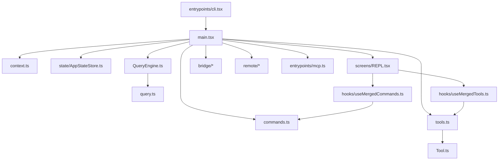

# 核心模块详解

## 1. 入口与启动模块

### `entrypoints/cli.tsx`

职责：

- CLI bootstrap
- 特殊命令 fast-path 分流
- 在需要时再动态导入完整运行时

关键点：

- 用动态导入降低冷启动成本
- 对 `remote-control`、`daemon`、背景 session 等路径做提前拦截
- 对部分模式做权限与策略检查

适合理解的问题：

- 为什么某些命令不需要完整加载整个 CLI
- 主程序启动前做了哪些短路径优化

### `main.tsx`

职责：

- 主程序入口
- 交互/非交互模式判断
- commander 初始化
- `init()` 调用
- 命令、工具、会话环境统一装配

关键函数：

- `main()`
- `run()`
- `getInputPrompt()`

要点：

- `main()` 偏进程入口控制
- `run()` 偏业务运行调度
- `getInputPrompt()` 处理非 TTY / stdin 输入兼容

## 2. 命令系统

### `commands.ts`

职责：

- 聚合所有可见命令
- 统一做 feature flag、权限与模式过滤
- 映射命令到 skill/tool 语义

关键函数：

#### `getCommands()`

作用：

- 统一返回当前上下文下可用的命令集合

为什么重要：

- 它是命令系统的总入口
- REPL、headless 以及扩展系统都依赖它产出最终命令视图

#### `getSkillToolCommands()`

作用：

- 把命令系统中适合作为 skill/tool 暴露的部分进行二次整理

#### `getSlashCommandToolSkills()`

作用：

- 将 slash commands 转换为模型可理解的 skill 形式

设计特点：

- 命令不是硬编码在某个单点，而是由多个来源汇合
- 内建命令与插件命令、skill 命令、workflow 命令并列存在

## 3. 工具系统

### `Tool.ts`

职责：

- 定义工具协议
- 定义工具执行上下文
- 承载权限、状态、消息与进度协同

关键类型：

#### `ToolUseContext`

这是最重要的核心类型之一，可以视为“工具调用时的运行时容器”。

它至少承载了以下信息：

- commands
- tools
- mainLoopModel
- thinkingConfig
- mcpClients
- AppState 的读写能力
- 当前消息历史
- 文件缓存与文件历史
- 进度与 UI 通知接口
- query tracking
- content replacement state

为什么重要：

- 工具调用不是孤立行为，而是在完整会话上下文里执行
- 这个类型直接体现了系统的耦合点和可扩展边界

#### `ToolPermissionContext`

作用：

- 描述工具权限模式
- 管理 allow / deny / ask 规则
- 控制额外工作目录与提示策略

### `tools.ts`

职责：

- 内建工具注册
- 权限过滤
- 模式过滤
- MCP 工具合并

关键函数：

#### `getAllBaseTools()`

作用：

- 定义内建工具全集

可见工具类型包括：

- Agent / Task 工具
- Bash
- Glob / Grep
- FileRead / FileEdit / FileWrite
- NotebookEdit
- WebFetch / WebSearch
- TodoWrite
- SkillTool
- AskUserQuestion
- Plan/Worktree/REPL 相关工具
- MCP resource 工具

#### `getTools(permissionContext)`

作用：

- 依据权限和模式返回可用内建工具

关键逻辑：

- simple mode 下仅保留最小工具集
- REPL mode 下隐藏部分 primitive tools
- deny rules 在工具暴露前就执行

#### `assembleToolPool(permissionContext, mcpTools)`

作用：

- 把内建工具与 MCP 工具装配成最终工具池

设计价值：

- 确保 REPL 与子代理使用一致的工具组装逻辑
- 内建工具和外部工具共享同一过滤机制

## 4. 查询执行系统

### `QueryEngine.ts`

职责：

- 单次或多次会话交互的总控层
- 维护消息、权限拒绝、总用量与文件缓存
- 把用户输入转译为查询主循环的参数

关键类：

#### `QueryEngine`

核心字段：

- `mutableMessages`
- `abortController`
- `permissionDenials`
- `totalUsage`
- `readFileState`
- `discoveredSkillNames`

关键方法：

#### `submitMessage(prompt, options)`

作用：

- 负责一次完整用户消息提交的全生命周期

步骤：

1. 重置 turn 级状态
2. 拉取 system prompt 各组成部分
3. 构建 `ToolUseContext`
4. 处理 orphaned permission
5. 调用 `processUserInput()`
6. 再进入 `query()`

为什么重要：

- 这是 session 入口与 query loop 之间的桥梁

#### `ask()`

作用：

- 对 `submitMessage()` 的 one-shot 封装

适用场景：

- SDK 或脚本型直接调用

### `query.ts`

职责：

- 模型主循环
- 工具回合控制
- 上下文压缩与预算管理

关键函数：

#### `query(params)`

作用：

- 对 `queryLoop()` 的封装，附带 command lifecycle 收尾

#### `queryLoop(params, consumedCommandUuids)`

作用：

- 真实执行多轮 query / tool-use / compact / resume 循环

关键机制：

- memory prefetch
- skill prefetch
- tool result budget
- snip
- microcompact
- context collapse
- autocompact
- query tracking

为什么重要：

- 这里是系统“像代理一样工作”的核心现场

## 5. 上下文系统

### `context.ts`

职责：

- 生成系统上下文
- 生成用户上下文

关键函数：

#### `getSystemContext()`

内容包括：

- git status 快照
- main branch 信息
- recent commits
- cache breaker 注入

意义：

- 为模型提供仓库态势感知

#### `getUserContext()`

内容包括：

- `CLAUDE.md` / memory 文件
- 当前日期

意义：

- 把项目约束和用户环境约束拼到 prompt 前文

## 6. 状态管理系统

### `state/AppStateStore.ts`

职责：

- 定义全局状态结构

关键类型：

#### `AppState`

这是 UI、MCP、远控、任务、插件、session hooks 的共同状态模型。

高价值字段分组：

1. 运行控制
   - `settings`
   - `verbose`
   - `mainLoopModel`
   - `toolPermissionContext`

2. UI / 交互
   - `statusLineText`
   - `expandedView`
   - `footerSelection`

3. remote / bridge
   - `remoteSessionUrl`
   - `remoteConnectionStatus`
   - `replBridgeEnabled`
   - `replBridgeConnected`
   - `replBridgeSessionUrl`

4. 扩展
   - `mcp`
   - `plugins`
   - `agentDefinitions`

5. 任务与历史
   - `tasks`
   - `fileHistory`
   - `todos`
   - `notifications`

### `state/onChangeAppState.ts`

职责：

- 把状态变更后的副作用集中处理

价值：

- 防止副作用散落在各组件与工具中

## 7. REPL 与装配层

### `screens/REPL.tsx`

职责：

- 交互式主界面
- 合并命令、工具、插件、MCP
- 管理输入、输出、消息视图、任务面板

### `hooks/useMergedCommands.ts`

职责：

- 将本地命令、插件命令、MCP 命令汇总为最终命令集合

### `hooks/useMergedTools.ts`

职责：

- 调用 `assembleToolPool()` 合并内建工具和 MCP 工具

这两个 hook 的价值在于：

- 把 REPL 的装配逻辑从页面组件中抽出
- 保持命令与工具的来源统一

## 8. MCP 相关模块

### `entrypoints/mcp.ts`

职责：

- 以 stdio 方式启动 MCP server
- 暴露内部工具为 MCP tools

关键函数：

#### `startMCPServer(cwd, debug, verbose)`

执行流程：

1. 创建读文件缓存
2. 创建 MCP `Server`
3. 实现 `ListToolsRequestSchema`
4. 实现 `CallToolRequestSchema`
5. 将内部工具描述转换为 MCP schema
6. 通过 stdio transport 启动

意义：

- 说明该系统不仅能消费工具，也能把自己反向输出为工具平台

## 9. 远程与桥接模块

### `bridge/replBridge.ts`

职责：

- 本地 REPL 与远端控制环境之间的桥接核心

典型能力：

- session 创建
- ingress message 处理
- 控制请求 / 结果回流
- 与 bridge API、bridge messaging 协同

### `bridge/bridgeApi.ts`

职责：

- bridge HTTP API 客户端封装

关键点：

- bridge id 校验
- fatal error 包装

### `remote/RemoteSessionManager.ts`

职责：

- 管理远程 session 的连接、事件流与权限交互

## 10. Python 子项目核心模块

### `chanlun_backtest/chanlun_engine.py`

关键对象：

- `ZhongShu`
- `TrendTimeline`
- `BSPoint`
- `ChanEngine`

关键函数/方法：

- `load_bars()`
- `compute_macd()`
- `build_zhongshu_list()`
- `detect_signals()`

职责：

- 因果式缠论信号检测
- 中枢、背驰、一二三类买卖点判定
- 多级别联立过滤

### `chanlun_backtest/backtest.py`

关键对象：

- `Trade`

关键函数：

- `run_backtest()`
- `evaluate_trades()`
- `trades_to_df()`

职责：

- 信号撮合
- 单仓位反手交易模拟
- 绩效统计

### `chanlun_backtest/smc_engine.py`

关键对象：

- `SMCPoint`
- `SMCEngine`

职责：

- FVG / OB / BOS / CHoCH 因果式检测
- 显式记录 `bar_id` 以避免未来函数

### `chanlun_backtest/duan_engine.py`

关键对象：

- `Duan`

关键函数：

- `_merge_char_seq()`
- `build_duan_list()`

职责：

- 基于特征序列法构建线段
- 用于“小转大”结构递归级别检验

## 11. 关键依赖关系

可以用下面这张图理解主系统依赖关系：

## 12. 阅读优先级建议

如果要最短路径读懂主系统，建议按这个顺序：

1. `README.md`
2. `entrypoints/cli.tsx`
3. `main.tsx`
4. `commands.ts`
5. `tools.ts`
6. `Tool.ts`
7. `QueryEngine.ts`
8. `query.ts`
9. `context.ts`
10. `state/AppStateStore.ts`
11. `screens/REPL.tsx`
12. `entrypoints/mcp.ts`
13. `bridge/` 与 `remote/`
