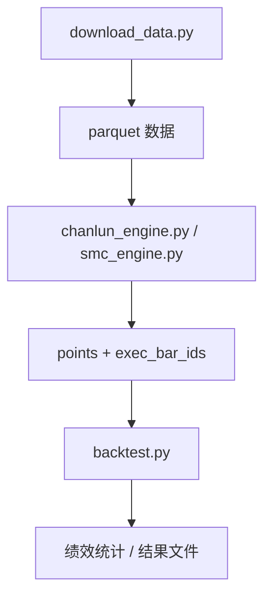

# chanlun_backtest 子项目

## 1. 子项目定位

`chanlun_backtest/` 是仓库中的独立 Python 回测研究项目，不属于主 TypeScript CLI/TUI 运行时。

它的目标是：

- 用严格因果式方法实现缠论核心规则
- 在真实数字货币历史数据上做回测
- 对 SMC、随机基线、背驰理论与“小转大”做验证

从结构上看，它更接近“研究型量化实验仓库”，而不是可复用服务端框架。

## 2. 目录结构

| 文件 | 作用 |
| --- | --- |
| `download_data.py` | 从 Binance 公共历史数据集下载 K 线 |
| `chanlun_engine.py` | 缠论核心引擎 |
| `smc_engine.py` | SMC 特征提取与信号引擎 |
| `backtest.py` | 回测撮合与绩效统计 |
| `random_baseline.py` | 随机基线显著性检验 |
| `run_backtest.py` | 单周期回测入口 |
| `run_backtest_multilevel.py` | 多级别联立回测入口 |
| `run_smc_backtest.py` | SMC 回测入口 |
| `run_chan_smc_confluence.py` | 缠论与 SMC 组合测试 |
| `duan_engine.py` | 线段构建与“小转大”检验 |
| `run_duan_confluence.py` | 固定时钟级别与结构递归级别对比 |
| `validate_basic_logic.py` | 缠论基本逻辑独立验证 |
| `validate_beichi_alternatives.py` | 背驰理论稳健性复核 |
| `validate_beichi_zhongshu_anchored.py` | 基于真实中枢结构的背驰重验 |
| `test_smc_engine.py` | SMC 引擎测试 |
| `test_duan_engine.py` | 线段引擎测试 |

## 3. 子项目执行链

最常见的链路如下：



## 4. 缠论引擎

### 4.1 `load_bars()`

职责：

- 从 parquet 加载 K 线
- 转为 `czsc.RawBar` 列表
- 统一频率映射

### 4.2 `compute_macd()`

职责：

- 计算标准 MACD
- 采用 EMA 因果式计算

### 4.3 `ZhongShu`

职责：

- 表示中枢结构

核心字段：

- `bis`
- `zg`
- `zd`
- `start_idx`
- `end_idx`

### 4.4 `TrendTimeline`

职责：

- 表示大级别笔方向时间线
- 为小级别信号提供多级别联立过滤

核心方法：

- `direction_at(dt)`
- `allows(point)`

设计价值：

- 将“大级别方向”抽象成独立对象，便于小级别买卖点过滤

### 4.5 `BSPoint`

职责：

- 表示缠论买卖点信号

核心字段：

- `kind`
- `side`
- `dt`
- `price`
- `bar_id`

### 4.6 `ChanEngine`

职责：

- 因果式缠论信号检测核心类

关键能力：

- MACD 预处理
- 笔力度计算
- MACD 面积计算
- 中枢构建
- 买卖点检测

关键方法：

#### `_bi_price_power(bi)`

作用：

- 用百分比涨跌幅而不是绝对价差衡量笔力度

设计原因：

- 避免极小价格量级下被 round 后失真

#### `_bi_macd_area(bi)`

作用：

- 计算笔区间内与方向一致的 MACD 柱面积

#### `build_zhongshu_list(bi_list)`

作用：

- 从已确认笔序列构造中枢列表

#### `detect_signals(bi_list)`

作用：

- 基于当前已确认笔序列检测一二三类买卖点

设计要点：

- 明确强调只使用当前及之前的信息
- 针对背驰比较对象与三类买卖点判定有详细 bug 修复说明

## 5. 回测模块

### `Trade`

职责：

- 表示单笔交易结果

字段包括：

- 开平仓时间
- 开平仓价格
- 开平仓原因
- 收益率

### `run_backtest(bars, points, exec_bar_ids, fee_rate)`

职责：

- 根据信号序列执行回测撮合

规则特点：

- 使用“信号被程序发现时所在 K 线的下一根 K 线开盘价”成交
- 始终单仓位
- 新信号会先平反向仓，再开同向仓
- 数据结束时强制平仓

### `evaluate_trades(trades)`

职责：

- 计算胜率、平均盈利、平均亏损、盈亏比、累计收益率、最大回撤等指标

### `trades_to_df(trades)`

职责：

- 把交易结果导出成 DataFrame

## 6. SMC 引擎

### `SMCPoint`

职责：

- 表示 SMC 信号

字段与 `BSPoint` 保持相近接口，便于复用同一套回测撮合逻辑。

### `SMCEngine`

职责：

- 提取 SMC 相关信号

主要参数：

- `swing_window`
- `volume_ma_window`
- `fvg_vol_mult`

关键方法：

#### `_build_frame(bars)`

作用：

- 将 RawBar 转为 DataFrame，便于向量化计算

#### `_detect_fvg_and_ob(df)`

作用：

- 检测 FVG 与订单块

关键设计：

- 不使用分块流式读取
- 明确记录 `confirmed_id`
- 防止 chunk 边界漏信号和未来函数问题

#### `_detect_structure(df)`

作用：

- 检测 swing high/low、BOS、CHoCH

关键设计：

- 摆点必须等待确认窗口结束
- 结构状态机只使用当前时刻前已经确认的摆点

#### `run()`

作用：

- 输出 `points` 与 `exec_bar_ids`
- 对信号确认时刻做因果性自证

## 7. 线段与“小转大”

### `Duan`

职责：

- 表示线段结构

字段和属性：

- `bis`
- `direction`
- `fx_a`
- `fx_b`
- `high`
- `low`

### `_merge_char_seq(char_seq, new_elem, direction)`

职责：

- 做特征序列包含处理

### `build_duan_list(bi_list)`

职责：

- 用特征序列法从笔序列构建线段

项目价值：

- 把“大级别方向”从固定时钟重采样切换为结构递归定义
- 用来检验固定时钟级别与结构级别的差异

## 8. 运行方式

### 8.1 安装依赖

```bash
pip install czsc pandas numpy pyarrow requests
```

### 8.2 下载数据

```bash
python download_data.py PEPEUSDT 2025-06 2026-05
python download_data.py ORDIUSDT 2025-06 2026-05
python download_data.py ZECUSDT 2025-06 2026-05
```

### 8.3 单周期回测

```bash
python run_backtest.py --symbol PEPEUSDT --freqs 1m 5m 30m --fee 0.001
```

### 8.4 多级别联立回测

```bash
python run_backtest_multilevel.py --symbol PEPEUSDT --fee 0.001
```

## 9. 子项目的工程特征

这个子项目最鲜明的特点不是“策略复杂”，而是“反复强调因果性与无未来函数”。

主要体现为：

- 笔构建依赖流式 `czsc`
- 成交价用下一根 K 线开盘价
- SMC 明确记录确认 bar_id
- 多处加入运行时自证与 bug 复盘说明

这说明作者关注点并非单纯追求高收益，而是优先保证研究结论的可解释性和可复现性。

## 10. 子项目总结

`chanlun_backtest/` 是一个围绕缠论、SMC 与结构递归验证展开的研究性回测项目。它的核心不是服务化架构，而是：

- 把信号生成做成明确的因果式算法
- 把撮合与绩效统计独立出来
- 把理论验证、随机基线和结构检验作为完整研究流程的一部分
